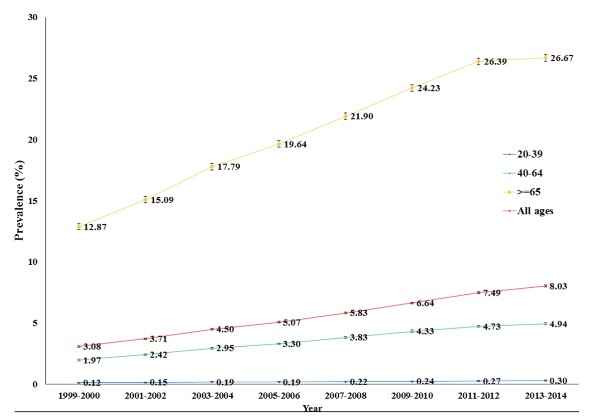

# Project Description

## Abstract

A patient is described as undergoing polypharmacy if they simultaneously take more than five medications.
While often necessary for treating multimorbid or vulnerable patients, polypharmacy is associated with various risks such as adverse drug interactions, increased incidence, and severity of side effects, poor compliance, and decline in the patient's quality of life[^1].\
Polypharmacy presents a distinct and frequently non-linear side effect profile that is, in many cases, still poorly understood.\
Polypharmacy affects 15% of the general population in the U.S. and about 10-20% in different European countries, with the incidence of polypharmacy rising sharply with age and poor health; in care settings, polypharmacy incidences above 50% are not uncommon[^2]^,^[^3].\
Globally, polypharmacy affects hundreds of millions of people, a trend that is rising as the global population ages.

Because the number of possible combinations of different drugs increases exponentially with the number of drugs a patient is taking, systematic laboratory testing of every possible combination of drugs for unwanted side effects is not practical.\
To nevertheless address the problem of drug-drug interaction, our project aims to use advanced graph-based machine learning algorithms to predict drug interactions from the knowledge we have gained about which pathways of the human body each drug affects.\
Using this approach, it is also possible to incorporate knowledge of the individual genome or microbiome of the patient into the model, delivering care personalized to each patient.

## Approach

Our vision is to use our model to provide doctors with the tools to do no harm by prescribing safe and healthy combinations of drugs, improving patient quality of life.\
In order to make this vision a reality, we have established a close partnership with the Department of Clinical Pharmacology at the University Hospital Aachen in Germany.\
This collaboration allows us to gather input from key medical stakeholders to deliver a practical, easy-to-use software that is able to empower the medical community from the get-go.\
Through the network of RWTH Aachen, we would also be able to deploy our model in other German university hospitals and, ultimately, internationally.

## Motivation
Our team was deeply motivated to choose this project because of the personal experiences many of us have had with elderly family members, particularly our grandparents. Witnessing our grandparents taking a plethora of medications at once, with sometimes more than five just for breakfast, sparked a sense of concern and curiosity among us.\
It made us question the safety and efficacy of such an approach and led us to investigate polypharmacy. Socially, polypharmacy affects the quality of life of a large section of the population. Over 80% of nursing home residents[^4] and over 70% of hospitalized patients[^5] are affected by polypharmacy.\
This indicates that a significant proportion of the community is at risk of adverse drug reactions, impacting not just their health but also the well-being of their families. Seeing the gravity of the situation and the role polypharmacy plays in the lives of our loved ones, we came to the conclusion that we ought to focus our efforts on alleviating the problem.

!!! example "Trends in Polypharmacy"
    <figure markdown>
        { width=600" }
    <figcaption>Trends in polypharmacy among adults in the Netherlands 1999–2014, stratified by age.[^6]</figcaption>
    </figure>

[^1]: Van Wilder L, Devleesschauwer B, Clays E, Pype P, Vandepitte S, De Smedt D. Polypharmacy and Health-Related Quality of Life/Psychological Distress Among Patients With Chronic Disease. Prev Chronic Dis 2022;19:220062. [http://dx.doi.org/10.5888/pcd19.220062](http://dx.doi.org/10.5888/pcd19.220062).
[^2]: Lee, Georgie, et al. "The Patterns and Implications of Potentially Suboptimal Medicine Regimens among Older Adults: a Narrative Review." Therapeutic Advances in Drug Safety, 2022, [https://doi.org/10.1177/20420986221100117](https://doi.org/10.1177/20420986221100117).
[^3]: Kantor ED, Rehm CD, Haas JS, Chan AT, Giovannucci EL. Trends in Prescription Drug Use Among Adults in the United States From 1999-2012. [https://doi.org/10.1001/jama.2015.13766](https://doi.org/10.1001/jama.2015.13766).
[^4]: Calcaterra, Laura, et al. "Predictors of Drug Prescription in Nursing Home Residents: Results from the INCUR Study." Internal and Emergency Medicine, vol. 17, no. 1, 2022, pp. 165-171,  [https://doi.org/10.1007/s11739-021-02841-6](https://doi.org/10.1007/s11739-021-02841-6).
[^5]: Trumic, Edisa, et al. "Prevalence of Polypharmacy and Drug Interaction Among Hospitalized Patients: Opportunities and Responsabilities in Pharmaceutical Care." Materia Socio-Medica, vol. 24, no. 2, 2012, pp. 68-72,  [https://doi.org/10.5455/msm.2012.24.68-72](https://doi.org/10.5455/msm.2012.24.68-72).
[^6]: Oktora, Monika, et al. "Trends in Polypharmacy and Dispensed Drugs among Adults in the Netherlands as Compared to the United States." PLOS ONE, vol. 14, no. 3, 2019, p. e0214240,  [https://doi.org/10.1371/journal.pone.0214240](https://doi.org/10.1371/journal.pone.0214240).