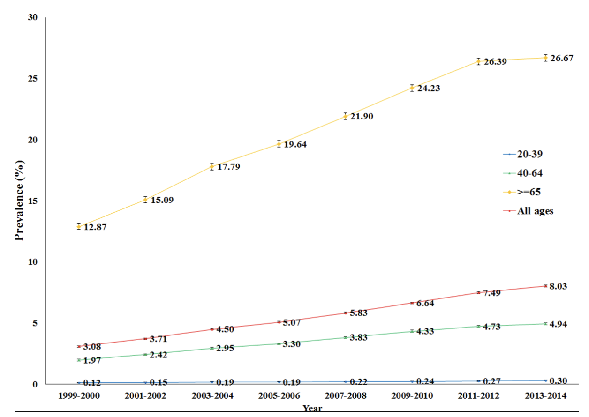

## Background

### Problem statement

Polypharmacy is the simultaneous use of multiple (generally defined as more than 5) medications by a patient.
While often necessary, in some cases, polypharmacy is associated with various risks such as adverse drug interactions, increased side effects, medication non-adherence, and a decline in the patient's quality of life (Polypharmacy and Health-Related Quality of Life/Psychological Distress Among Patients With Chronic Disease, Van Wilder et al., 2022). Since polypharmacy side effects are notoriously difficult to predict, it can make adhering to the Primum non nocere (first, do no harm) principle very difficult.
As such, Polypharmacy is recognized as an increasingly serious problem affecting nearly 15% of the U.S. population (Trends in Prescription Drug Use among Adults in the United States, Kantor et al., 2015) and causing treatment costs of over $177 billion a year in the U.S. alone (Drug-related morbidity and mortality: updating the cost-of-illness model, Ernst, and Grizzle, 2001). According to “A 12-gene pharmacogenetic panel to prevent adverse drug reactions: an open-label, multicentre, controlled, cluster- randomized crossover implementation study” by Swen et al. 2023, pharmacogenetic-panel testing alone can reduce a patient’s direct medical charges by more than USD 7000.
The US are not the only country affected by this problem. In “Trends in polypharmacy and dispensed drugs among adults in the Netherlands as compared to the United States” Oktora et al. conducted a cross-sectional study in the netherlands, finding that polypharmacy prevalence increased from 3.1% to 8.0% over the time period from 1999 to 2014, as depicted in figure 1.

<figure markdown>
  { width="600" }
  <figcaption>Figure 1</figcaption>
</figure>

### Motivation

Our team was deeply motivated to choose this project because of the personal experiences many of us have had with elderly family members, particularly our grandparents.
Witnessing our grandparents taking a plethora of medications at once, with sometimes more than five just for breakfast, sparked a sense of concern and curiosity among us.
It made us question the safety and efficacy of such an approach and led us to investigate polypharmacy.
Socially, polypharmacy affects the quality of life of a large section of the population. Over 80% of nursing home residents (Predictors of drug prescription in nursing home residents: results from the INCUR study, Calcaterra et al., 2021)  and over 70% of hospitalized patients (Prevalence of Polypharmacy and Drug Interaction Among Hospitalized Patients: Opportunities and Responsibilities in Pharmaceutical Care, Trumic et al., 2012) are affected by polypharmacy.
This indicates that a significant proportion of the community is at risk of adverse drug reactions, impacting not just their health but also the well-being of their families.
Seeing the gravity of the situation and the role polypharmacy plays in the lives of our loved ones, we came to the conclusion that we ought to focus our efforts on alleviating the problem.

## Approach

### Previous work

We will base our project on the "Decagon" paper published in 2018 by Marinka Zitnik et al.
The paper titled “Modeling Polypharmacy Side Effects with Graph Convolutional Networks”, is the most notable work in the field.
This approach takes into account the polypharmacy side effects and models them using a multimodal graph that includes protein-protein interaction networks and drug-drug interaction networks.
However, the presented method has its limitations.
It only uses network information and does not incorporate chemical structure information.
It only makes predictions for known compounds.
The model has been trained on datasets that are over six years old at this point.
It is implemented in TensorFlow, which has been surpassed by Pytorch as the standard in industry and academia.
New technologies, such as Encoder/Decoder and Large Language Models (LLMs) have since emerged which have uprooted the entire field.
Due to the lack of a user interface, there is a high barrier to entry for medical professionals. As such, clinicians, researchers, and biologists have not had the chance to make polypharmacy side effect predictions.
We aim to improve every aspect mentioned above and integrate the work that has previously been done with our own novel approach.

### Our project

Using the “Decagon”-model as a basis, we intend to train our own neural network using more recent datasets that include a greater number of drug interactions. Additionally, we will leverage the chemical structure of medications to increase our model’s accuracy for predictions on unknown compounds. We will also look into ways to improve the model’s architecture taking recent developments in the field of deep learning into account. Furthermore, we have developed a relationship with a team at the University Hospital RWTH Aachen, allowing us to rely on patient data and practical feedback, therefore ensuring that we will be able to provide the best possible project for both patients and doctors.