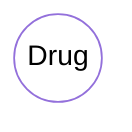
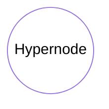
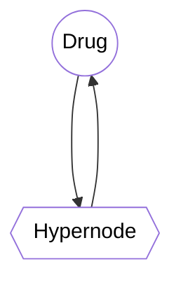
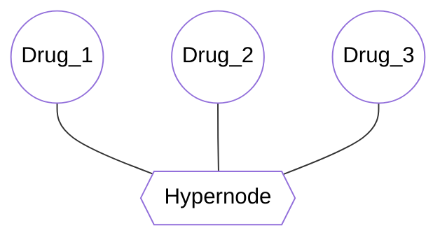

# Model
<figure>
<iframe title="MunichBioinformatics: Sepia Architecture Explainer (2023) [English]" width="1120" height="630" src="https://video.igem.org/videos/embed/d95b8649-d967-484b-9921-f1fc73a858fc" frameborder="0" allowfullscreen="" sandbox="allow-same-origin allow-scripts allow-popups"></iframe>
</figure>


## Polypharmacy Dataset
We illustrated 2 datasets that provide information about polypharmacy. 

The first dataset is a preprocessed train/test/validation dataset, provided within the Decagon paper [^1]. The dataset incorporates human drug-drug interaction networks with side effects as indication of polypharmacy interactions, all compiled from different sources. 

Second dataset uses data from NSIDES [^2] project databank, which includes data for drug side effects (OFFSIDES) and drug-drug pair side effects (TWOSIDES). These data represent an update from the data released to include adverse events reported to the FDA through database FDA Adverse Event Reporting System (FAERS) up to and including 2014, that contains information on adverse event and medication error. The dataset incorporates clinical reports with the taken drugs with their side effects, which in the report contains 1 to 49 drug combinations with reported side effects.

### Dataset Preprocessing

#### Dacagon Dataset

This dataset is already preprocessed, details see [^4]

#### Nsides Dataset

* **Extract Chemical Structure Embeddings**

We downloaded the entire STITCH databank version 5.0 with the names and SMILES strings of STITCH's chemicals. The the SMILES were canonicalized before the extraction of the chemical structure embeddings from MolFolmer (cite needed), chemicals are filtered when the extracted embeding is NA. Thus, we stored STITCH id, drug names and their chemical embedding into a table.

* **Map Drug Names from Nsides with STITCH id**

The drug concept name from Nsides dataset were mapped with the drug names from the table with STITCH id, drug names and their chemical embedding. Drugs that can't be mapped are filtered. Thus, we stored the processed drug category from Nsides with STITCH id, drug names and their chemical embedding into a table.

* **Quality Control and Dataset Splitting**

In quality contrial, report ids that contains any drugs that is not in our drug category are removed and we selected reports with 2 to 10 drug combination usage. After quality control, the dataset is splited into train, validation, and test set in 0.8, 0.1, 0.1 ratio respectively by the report ids.


### Preprocessed Dataset

|                                          | Decagon | Nsides  |
|------------------------------------------|---------|---------|
| Number of Drugs                          | 645     | 2204    |
| Number of Side Effects                   | 963     | 17552   |
| Max number of Drug Combinations          | 2       | 10      |
| Polypharmacy Interactions for Training   | 4512911 | 2878989 |
| Polypharmacy Interactions for Validation | 19785   | 357294  |
| Polypharmacy Interactions for Testing    | 19842   | 357301  |


## Graph Structure

We construct a knowledge graph (KG). The graph consists of nodes of two types, drugs and hypernodes. The edges of the graph correspond to different drug combinations. The node feature of the drugs are based on chemical structures, and each hypernode feature signifies the side effects.

## Chemical Structure Embeddings

The chemical structure embeddings are extracted using MOLFORMER, a large-scale chemical language representations to capture molecular structure and properties published by IBM. Which employs a linear attention mechanism, coupled with highly distributed training, on sequences of 1.1 billion unlabelled molecules from the PubChem and ZINC datasets. The chemical language embedding were extracted for Nsides dataset, the SMILES of the drugs were used to generate the embedding to provide biological meaningful information.

## Introduction to SAGEConv Architecture

SAGEConv learns node representations by aggregating information from the neighborhood of each node, which allows it to capture more complex features. SAGEConv uses degree-normalized aggregation function allows SAGEConv to capture more fine-grained information about the local neighborhood of each node, which can be particularly useful in tasks such as link prediction and graph classification.


## Hetrograph Construction

### Nodes

* **Drugs**: Represent the drugs with chemical structure embedding. 



```python title="drug_node_construct"
# create HeteroData with drug nodes and chemical structure embeddings
graph = HeteroData({
    "drugs": {'x': torch.tensor(drugs["features"]).to(torch.float32), "label": drugs[0]},
})
```

* **Hypernodes**: Represented the polypharmacy cases, these nodes store aggregated information of side effects caused by drug combinations.



```python title="hypernode_construct"
# add values in hypernodes.x of the graph for message passing
graph["hypernodes"].x = side_effect_tensor.to(torch.float32)
graph["hypernodes"].effect_ids = [torch.tensor(item) for item in polypharmacy_grouped["side_effect"]]
```


### Edges

* **Hyperedge Part 1**: Directed edges connecting drug nodes to hypernodes, indicating that a certain combination of drugs is associated with specific side effects stored in the hypernodes.

* **Hyperedge Part 2**: Directed edges connecting hypernodes back to drug nodes. These edges, in conjunction with Hyperedge Part 1, form hyperedges that encapsulate the relationships between drug combinations and their side effects.




```python title="hyperedge_construct"
# create hyperedge
graph["drugs", "hyperedge_part_1", "hypernodes"].edge_index = torch.cat(
    (torch.from_numpy(np.array(polypharmacy_grouped["drug_combination"].explode().astype(float).astype(np.int64), dtype=np.int64)), 
        torch.tensor(polypharmacy_grouped["drug_combination"].explode().index)
        )
).reshape(-1, len(polypharmacy_grouped["drug_combination"].explode())
).to(torch.int64)

graph["hypernodes", "hyperedge_part_2", "drugs"].edge_index = torch.cat(
    (torch.tensor(polypharmacy_grouped["drug_combination"].explode().index), 
    torch.from_numpy(np.array(polypharmacy_grouped["drug_combination"].explode().astype(float).astype(np.int64), dtype=np.int64))
    )
).reshape(-1, len(polypharmacy_grouped["drug_combination"].explode())
).to(torch.int64)
    
```


### Graph Construct Example with Trio Drugs




## Model Architecture

The model architecture, named SEPIA (Side Effect Prediction with Interaction Awareness), is designed for drug interaction and side effect prediction, leveraging the graph representation of polypharmacy data. The model consists of an Encoder and a Decoder.


```python title="sepia"
class SEPIA(nn.Module):
    def __init__(self, emb_dim, n_effects, n_hops):
        super(SEPIA, self).__init__()
        self.encoder = Encoder(emb_dim, n_effects, n_hops)
        self.decoder = Decoder(emb_dim)

    def forward(self, graph, x_nodes, effect_ids):
        graph_x = graph.x_dict
        edge_index = graph.edge_index_dict
        return self.decoder(self.encoder(graph_x, edge_index, x_nodes, effect_ids))
```

### Encoder:
* **Input**: \
Graph representation of the biological data, including drugs, proteins, and their interactions, along with identified side effects. 

* **Output**: \
Embeddings representing the drug combinational interactions and effects. 

* **Architecture**: \
Consists of SAGEConv instances for processing heterogeneous graph data, and an embedding layer for side effects.

``` python title="encoder"
class Encoder(nn.Module):
    def __init__(self, emb_dim, n_effects, n_hops):
        super(Encoder, self).__init__()

        self.effect_emb = nn.Embedding(n_effects, emb_dim)
        nn.init.xavier_uniform_(self.effect_emb.weight.data)

        self.layers = nn.ModuleList(
            GraphLayer(SAGEConv, emb_dim) for _ in range(n_hops)
        )
        self.act = F.relu
        
    def forward(self, graph_x, edge_index, x_nodes, effect_ids):
        for layer in self.layers:
            graph_x = layer(graph_x, edge_index)
            graph_x = {key: self.act(x) for key, x in graph_x.items()}
        
        embs = [graph_x['drugs'][nodes] + self.effect_emb(effect) for effect, nodes in zip(effect_ids, x_nodes)]
        return embs
```


### Decoder: 
* **Input**: \
Embeddings from the encoder. 

* **Output**: \
Predicted side effects in the form of a probability distribution between 0 and 1. 

* **Architecture**: \
A neural network that maps embeddings to side effect predictions.

```python
class Decoder(nn.Module):
    def __init__(self, emb_dim):
        super(Decoder, self).__init__()
        self.Sigmoid = nn.Sigmoid()
        self.Linear = nn.Linear(emb_dim, 1)

    def forward(self, embs):
        embs = torch.stack([torch.prod(x, dim=0) for x in embs])
        return self.Sigmoid(self.Linear(embs))
```

### Negative Sampler:

* **Input**: \
Graph, Batch size, and number of side effects we want to generate.

* **Output**: \
Randomly generated node ids and side effects.

* **Functionality**: \
Generate negative samples (Random Side effects) for training the SEPIA model.

    1. **Compute Distribution**: Calculates the distribution of hyperedge sizes in the graph using the hyperedge_size_distribution(graph) function.

    2. **Random Number of Nodes**: Randomly selects a number of nodes to include in each negative sample, based on the computed distribution. This means each negative sample could have a different number of nodes.

    3. **Generate Negative Samples**: For each batch, randomly selects a set of nodes and an effect to create a negative sample. The nodes are selected randomly from the "drugs" node type in the graph, and the effects are chosen randomly from the total number of possible effects.


```python

def hyperedge_size_distribution(graph):
    out_edges = graph.edge_index_dict[('hypernodes', 'hyperedge_part_2', 'drugs')][0]
    counts = torch.bincount(torch.bincount(out_edges))
    fractions = counts / sum(counts)
    distribution = {
        i: float(fractions[i]) for i in range(len(fractions))
    }
    return distribution

def random_neg_sample(graph, batch_size, n_effects):
    distribution = hyperedge_size_distribution(graph)
    num_nodes = np.random.choice(list(distribution.keys()), p=list(distribution.values()))
    nodes = [torch.tensor(np.random.choice(len(graph["drugs"].x), size=num_nodes,replace=False)) for _ in range(batch_size)]

    effects = [torch.tensor(np.random.choice(n_effects)) for _ in range(batch_size)]
    
    return nodes, effects
```


## Training Description

The training involves both the training of the SEPIA model and the negative sampler for negative sampling. The MLPgenerator generates negative samples to compare with the positive sample for SEPIA to seperate important features from noise.  The process is iterative, optimizing the model's parameters to better predict the side effects of drug interactions.

### Step by Step Training: 

**1. Costum Graph Dataloading**: 

Load the heterograph data in batches with the positive samples and the model.

```python
#Load hetero graph 
train_loader = HyperNodeLoader(train_graph, node_class, hypernode_class, hyperedge_class, n_hops, batch_size, shuffle, drop_fraction)

# Load SEPIA
model, neg_sampler = get_models(
    {"sepia_params": {"embedding_dim": 32}, "general_params": {"n_hops": 2}, "neg_sampler_params": {"layers": [64, 32]}}, 
    train_graph, 
    train_graph["hypernodes"].x.shape[1])

# Loop over batches
for pos_mask, pos_nodes, pos_effect_ids, hypernode_ids in tqdm(train_loader, desc="Training: "):

```

**2. Negative Sampling**: 

Generate negative sample to add noise in model training.


```python
neg_nodes, neg_effect_ids = random_neg_sample(train_graph, batch_size, len(train_graph["hypernodes"].x[0])) 
```


**3. Forward Pass**:  \ 
The SEPIA model takes the positive/negative graphs, processes it through the encoder to get embeddings, and then through the decoder to get side effect predictions.

```python
pos_preds = model(subgraph, pos_nodes, pos_effect_ids)
neg_preds = model(subgraph, neg_nodes, neg_effect_ids)

```


**4. Loss Computation**:  \
Computes the loss using a binary cross-entropy loss function, considering both positive and negative samples.
Backpropagation: Gradients are calculated and the model’s parameters are updated using an optimizer.


```python
# concatinate positive/negative predictions
preds = torch.cat((pos_preds, neg_preds))

# concatinate positive/negative labels
labels = torch.cat((
    torch.ones(len(pos_nodes)),
    torch.zeros(len(neg_nodes))
))

# compute the loss and perform backpropagation
loss_sepia = torch.nn.functional.binary_cross_entropy(preds.squeeze(), labels)
loss_sepia.backward(retain_graph=True)

# update model parameters
sepia_optimiser.step()

```
**5. Validation**: \
The model is evaluated on the validation dataset, where it predicts side effects for given interactions with the same training steps from 1 to 4.


### Key Model Features:
**Polypharmacy Modelling**: \
The data structure is designed to handle interactions between n drugs and m reports with O(nm) edges and .  

**Heterogeneous Graph Processing**: \
The model can handle graphs with multiple types of nodes and edges, making it suitable for complex biological data.

**Negative Sampling**: \
Enhances the training process by generating negative samples.

**Modular Architecture**:\
 The separation of encoder and decoder allows for flexibility and adaptability to different data and tasks.


## References

[^1]: Marinka Zitnik, Monica Agrawal, Jure Leskovec, Modeling polypharmacy side effects with graph convolutional networks, Bioinformatics, Volume 34, Issue 13, July 2018, Pages i457–i466, https://doi.org/10.1093/bioinformatics/bty294

[^2]: Vanguri, Rami; Romano, Joseph; Lorberbaum, Tal; Youn, Choonhan; Nwankwo, Victor; Tatonetti, Nicholas (2017). nSides: An interactive drug--side effect gateway. figshare. Dataset. https://doi.org/10.6084/m9.figshare.5483698.v2

[^3]: David Weininger. 1988. SMILES, a chemical language and information system. 1. introduction to methodology and encoding rules. J. Chem. Inf. Comput. Sci. 28, 1 (February 1988), 31–36. https://doi.org/10.1021/ci00057a005

[^4] Decagon dataset preprocessing. https://github.com/jbr-ai-labs/simvec/blob/main/data/data_preprocessing.ipynb 

[^5] STITCH databank. http://stitch.embl.de/

[^6] Molformer. https://github.com/IBM/molformer

[^7] Inductive Representation Learning on Large Graphs
William L. Hamilton, Rex Ying, Jure Leskovec https://arxiv.org/abs/1706.02216 